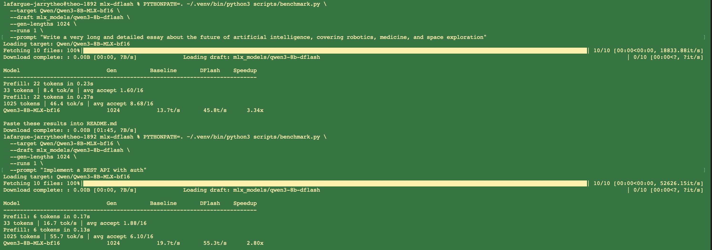

# mlx-dflash

Native MLX implementation of [DFlash](https://arxiv.org/abs/2602.06036) speculative decoding for Apple Silicon.

> **DFlash**: Block Diffusion for Flash Speculative Decoding — Chen et al., 2026

A small block-diffusion draft model generates 16 tokens **in parallel** (one forward pass). The target verifies them in one pass. Output is bit-for-bit identical to greedy baseline.

No CUDA. Pure MLX inference. *(Weight conversion requires torch as a one-time step, not at runtime.)*

---

## 📊 Results (M3 Max, 128GB)

Target: `Qwen/Qwen3-8B-MLX-bf16` — Draft: `mlx_models/qwen3-8b-dflash`

| Prompt Type | Gen length | Baseline | DFlash | Speedup | Accept rate |
|---|---|---|---|---|---|
| **Long Essay** | 1024 tokens | 13.7 tok/s | 45.8 tok/s | **3.34×** | 8.68/16 |
| **REST API Code** | 1024 tokens | 19.7 tok/s | 55.3 tok/s | **2.80×** | 6.10/16 |

### Execution Proof


*Speedup scales with generation length — acceptance rate improves as context grows. Bit-for-bit parity with baseline confirmed.*

---

## Install

```bash
pip install git+https://github.com/eauchs/mlx-dflash
```

Or from source:

```bash
git clone https://github.com/eauchs/mlx-dflash
cd mlx-dflash
pip install -e .
```

---

## ⏱️ Quick Start

### 1. Benchmark

```bash
python scripts/benchmark.py \
  --target Qwen/Qwen3-8B-MLX-bf16 \
  --draft  mlx_models/qwen3-8b-dflash \
  --gen-lengths 1024 \
  --runs 1
```

### 2. Python API

```python
import mlx_dflash.patch_qwen3  # must import first
from mlx_lm import load
from mlx_dflash import DFlashDraftModel, DFlashEngine
from safetensors.torch import load_file
import mlx.core as mx, json, glob, os

target, tokenizer = load("Qwen/Qwen3-8B-MLX-bf16")

with open("mlx_models/qwen3-8b-dflash/config.json") as f:
    config = json.load(f)
draft = DFlashDraftModel(config)
files = glob.glob(os.path.expanduser(
    "~/.cache/huggingface/hub/**/models--z-lab--Qwen3-8B-DFlash-b16/**/model.safetensors"),
    recursive=True)
draft.load_weights_from_original(load_file(files[0]))
mx.eval(draft.parameters())

engine = DFlashEngine(target, draft, tokenizer, block_size=16)
ids = mx.array([tokenizer.encode("Explain quantum computing.")], dtype=mx.int32)
out = engine.generate(ids, max_new_tokens=512)
print(tokenizer.decode(out[0].tolist()))
```

---

## Architecture

```
Target model (Qwen3-8B)
│
├─ Prefill → KV cache + hidden states [L0..LN]
├─ Extract context features from layers [L1, L9, L17, L25, L33] → fc → (B, ctx, D)
│
└─ Decode loop:
   ┌─ Draft model (5 lightweight layers, ~1B params)
   │   input:  embed([last_token] + [mask×15])
   │   cond:   context features from target hidden states
   │   attn:   causal within draft block, full attention over context
   │   output: hidden_states → target.lm_head → 15 logits
   │
   ├─ Verify: target([last_token] + draft_tokens) → 16 posterior logits
   │
   └─ Accept: greedy cumprod match → advance by (accept_len + 1)
```

---

## Apple Silicon Optimizations

- **Single `mx.eval()` per step** — posterior + predicted + both caches evaluated together to minimize CPU-GPU overhead.
- **Intra-GPU verify_ids** — `mx.concatenate` instead of Python `.tolist()` to avoid unnecessary syncs.
- **Draft KV cache** — accumulated across steps and cropped precisely on rejection to maintain state.
- **bfloat16 throughout** — draft weights loaded in bf16 to match target hidden states exactly and preserve precision.

---

## Notes

- Best results with bf16 target — quantized targets reduce acceptance rate significantly.
- Acceptance rate scales with generation length.
- Draft model `z-lab/Qwen3-8B-DFlash-b16` must match target `Qwen/Qwen3-8B`.

---

## Citation

```bibtex
@misc{chen2026dflash,
  title         = {DFlash: Block Diffusion for Flash Speculative Decoding},
  author        = {Chen, Jian and Liang, Yesheng and Liu, Zhijian},
  year          = {2026},
  eprint        = {2602.06036},
  archivePrefix = {arXiv},
  primaryClass  = {cs.CL},
}
```

---

## 📄 License

MIT. Draft model weights from z-lab are MIT licensed.
Independent MLX port — not affiliated with Z Lab.
